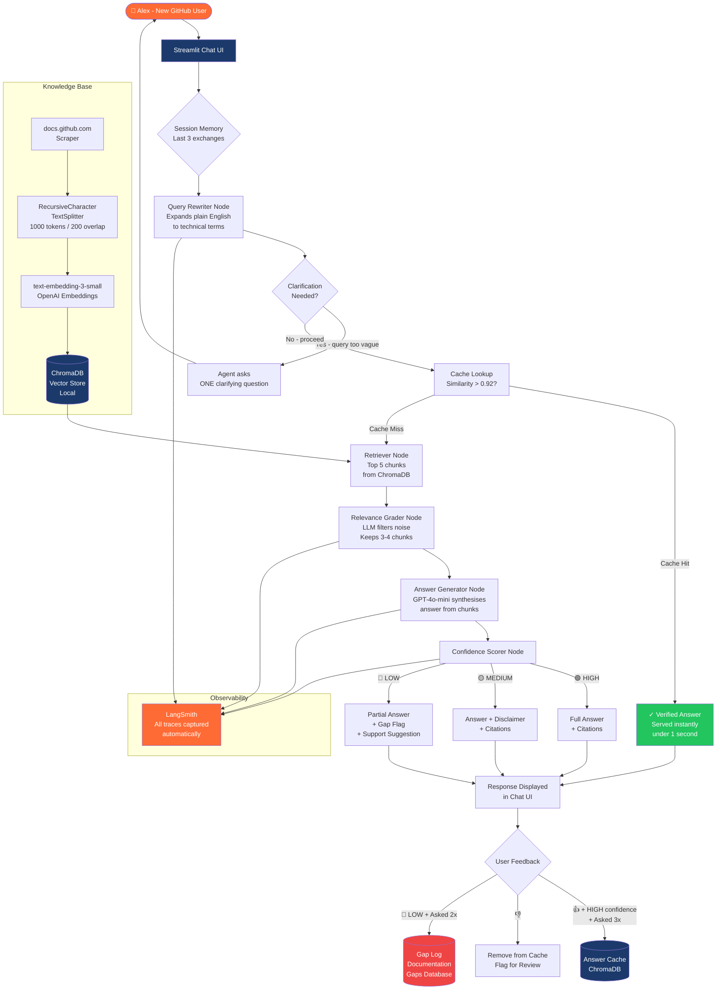

# Project 1 — Enterprise Onboarding RAG Agent
## GitHub Edition — Complete Design Document

**Status:** Final Draft  
**Author:** Prasenjeet Jena  
**Date:** March 19, 2026  
**Version:** 1.0  
**GitHub Repo:** ai-agent-portfolio/projects/01-github-onboarding-agent  

---

## 1. Problem Statement

### The Pain

New developers joining a company that uses GitHub Enterprise face an invisible productivity wall in their first 30 days.

GitHub's documentation spans thousands of pages across docs.github.com, community forums, and changelogs. When a new developer has a specific question — how do I set up branch protection, what permissions do I need to create a workflow, how do I configure required reviewers — they face three bad options:

- Spend 20 minutes searching documentation and reading 5 articles that almost answer the question
- Ask a colleague and interrupt their flow
- Raise a support ticket and wait

None of these are good. All of them cost time and money.

**The numbers:**
- Support tickets spike 3x in the first 30 days of any new user cohort
- The same 20-30 questions account for 70% of onboarding support tickets
- Support engineers spend 60% of their time answering questions already documented somewhere
- A 50-person team onboarding loses approximately 2-3 productive days per person to documentation friction

**The root cause:**
The knowledge exists. It is just fragmented, hard to find, and not optimised for how humans actually ask questions.

### The Opportunity

An AI agent that answers GitHub questions in plain English, cites its sources, knows when it does not know something, and gets smarter about documentation gaps over time.

---

## 2. User Persona

### Primary — Rogers, Senior Developer

**Situation:** 
- Just joined a company using GitHub Enterprise. 
- Experienced developer but unfamiliar with this company's specific GitHub setup — branch protection rules, required reviewers, 
- Actions workflows, internal package registry configuration.

**Behaviour:** 
- Does not want to ask questions in Slack. 
- Does not have 2 hours to read documentation. Needs specific answers to specific questions in under 60 seconds.

**Frustration:** 
- Search returns 10 articles that almost answer the question. 
- ChatGPT gives a plausible answer but it is for GitHub.com not GitHub Enterprise and it is based on stale training data.

**What success looks like for Rogers:** 
- Types a question in plain English. Gets a direct answer with a link to the exact documentation section. Unblocked in under 60 seconds.

### Secondary — Engineering Manager

**Situation:**
- Onboarding a new cohort of developers. 
- Has no visibility into what they are struggling with. 
- Finds out about documentation gaps when support tickets are raised — too late.

**What success looks like:** 
- Weekly digest of questions the agent could not answer confidently. 
- Knows exactly what to fix before the next onboarding cohort.

---

## 3. Solution Overview

### What We Are Building

A conversational RAG agent that:
- Answers GitHub questions grounded in real documentation
- Asks clarifying questions when the query is ambiguous
- Cites exact sources for every answer
- Scores its own confidence and tells the user when uncertain
- Remembers the last 3 exchanges in a session for context
- Flags unanswered questions as documentation gaps

### Why RAG and Not Just ChatGPT

| Problem with ChatGPT | How RAG Solves It |
|---------------------|------------------|
| Training data is stale | We ingest fresh docs — agent always has current knowledge |
| Answers about GitHub.com not Enterprise | We can ingest Enterprise-specific documentation only |
| No source citations | Every answer cites exact document and section |
| Hallucination risk | Agent only answers from retrieved documents |

### Why Vector RAG Specifically

We considered two approaches:

**Vectorless RAG (PageIndex):** 
- Keeps full document pages, LLM reads them directly. 
- Better for long narrative documents like legal contracts. 
- Higher cost per query.

**Vector RAG:** 
- Converts chunks to embeddings, retrieves only the most relevant chunks. 
- Better for structured technical documentation where each section answers a specific question — exactly what GitHub docs are. 
- Cheaper, faster, well-suited to this use case.

**Decision: Vector RAG.** 
- GitHub documentation is highly structured. 
- Each section has a clear topic. 
- Semantic similarity retrieval works extremely well for this content type.

---

## 4. Architecture Diagram




---

## 5. How It Works — Complete Flow

### Step by Step in Plain English

**STEP 1 — USER OPENS THE APP**
- Rogers sees a chat interface. Clean white background, blue header, orange accent buttons. 
- A welcome message explains what the agent can help with.

**STEP 2 — Rogers TYPES A QUESTION**
- Example: "how do I stop people from pushing directly to main?"

**STEP 3 — SESSION HISTORY CHECK**
- Agent looks at the last 3 messages in this session for context clues. Configurable from 1-10 via UI settings slider.

**STEP 4 — CLARIFICATION CHECK**
- Is the question specific enough for good retrieval?
- Specific enough → proceed to retrieval
- Too vague → agent asks ONE clarifying question maximum
  Example: "Are you asking about branch protection rules or CODEOWNERS file configuration?"

**STEP 5 — QUERY REWRITING**
- Query rewriter node reformulates Rogers's plain English question into retrieval-optimised language.

"how do I stop people from pushing directly to main?" → "GitHub branch protection rules required pull request reviews restrict direct push main branch enterprise"

Why: Documentation uses technical terms. Rogers uses plain English. 
The rewriter bridges the gap.

**STEP 6 — CACHE CHECK**
Has a semantically similar question been asked before with a HIGH confidence answer and positive feedback?
- Cache hit (similarity > 0.92) → serve cached answer instantly
    - Show "✓ Verified Answer" badge. Latency: under 1 second.
- Cache miss → proceed to retrieval

**STEP 7 — RETRIEVAL**
- ChromaDB searched for top 5 most semantically similar chunks to the rewritten query.

**STEP 8 — RELEVANCE GRADING**
- LLM reads each of the 5 chunks. Grades each: Relevant or Not.
- Filters out noise. Typically 3-4 chunks pass this filter.

**STEP 9 — ANSWER GENERATION**
- LLM synthesises relevant chunks into a direct, clear answer with source citations. Grounded ONLY in retrieved documents.
- If no relevant chunks found → agent says it does not have enough information.

**STEP 10 — CONFIDENCE SCORING**
🟢 HIGH — answer from official documentation, sources agree → Show answer normally

🟡 MEDIUM — answer synthesised from partial information → Show with disclaimer: "Verify before relying on this"

🔴 LOW — minimal relevant information found → Show partial answer + flag as gap + suggest support ticket

**STEP 11 — RESPONSE DISPLAYED**
Rogers sees: Direct answer, source citations with links, confidence badge, 👍 👎 feedback buttons.

**STEP 12 — FEEDBACK LOOP**
👍 → answer eligible for cache (if HIGH confidence + asked 3x)
👎 → removed from cache, flagged for review

---

## 6. Document Storage and Ingestion

### Source — docs.github.com (Scraped at Setup)

Python web scraper crawls docs.github.com at project setup time.

Pages ingested:
- Repositories — creating, managing, settings
- Pull requests — creating, reviewing, merging
- GitHub Actions — workflows, triggers, secrets
- Packages — publishing, consuming
- Security — code scanning, Dependabot, secret scanning
- Enterprise administration — permissions, policies, SSO
- GitHub Changelog — last 12 months of feature releases

Total estimated pages: 400-500 pages
Estimated ingestion time: 15-20 minutes on first run
Re-ingestion: Manual trigger when docs significantly updated

### Why Not Real-Time Scraping

Real-time scraping on every query adds 3-5 seconds of latency and unnecessary cost. Docs do not change hourly. Weekly or monthly re-ingestion is sufficient.

---

## 7. Chunking Strategy

### Approach — Recursive Character Splitting

Using LangChain's RecursiveCharacterTextSplitter.

**How it works:**
Splits documents at the most natural boundary available:
1. Double newline (paragraph break) — preferred
2. Single newline (line break) — second choice
3. Period / sentence end — third choice
4. Space — last resort
5. Character — only if nothing else works

Never breaks mid-sentence if avoidable.

**Configuration:**
- Chunk size: 1000 tokens
- Chunk overlap: 200 tokens

**Why 1000 tokens:**
GitHub documentation sections are typically 200-800 words. 
1000 tokens captures a complete section without cutting it.

**Why 200 token overlap:**
If an answer spans two chunks, the overlap ensures neither chunk loses the connecting context. Each chunk shares a paragraph with its neighbour.

**What we considered and ruled out:**
- Semantic chunking — 10x more expensive, overkill for v1. Listed as v2 improvement.
- Fixed size chunking — cuts sentences mid-thought. 

---

## 8. Vector Store

### Technology — ChromaDB (Local)

Open-source vector database that runs locally. No API costs, no cloud setup, works offline. Perfect for portfolio project.

**Why ChromaDB over Pinecone or Weaviate:**
Both are excellent production databases. For this project — ChromaDB gives identical functionality with zero infrastructure cost.

### Embedding Model — text-embedding-3-small

Converts text chunks to 1536-dimensional vectors.
- Best cost-to-quality ratio for English technical documentation
- $0.02 per million tokens — ingesting all GitHub docs ~$0.01
- Well-supported by LangChain

### How Retrieval Works

1. Question gets embedded using same model
2. ChromaDB finds 5 most similar vectors using cosine similarity
3. 5 corresponding text chunks returned
4. Relevance grader filters to 3-4 relevant chunks
5. Filtered chunks go to answer generator

---

## 9. Conversation Memory

### Approach — Sliding Window of 3 Exchanges

Agent remembers last 3 question-answer pairs within a session.

**Why 3 exchanges:**
Enough context for natural follow-up questions. More than 3 adds noise — earlier conversation is rarely relevant to the current question.

**How it works:**
LangChain ConversationBufferWindowMemory stores last k exchanges. 
Each new question sent to LLM with conversation history prepended.

**Session boundary — memory resets when:**
- User clicks "New Conversation" button
- Browser tab is closed
- Session inactive for 30 minutes

*Cross-session memory persistence is a Phase 2 feature.*

---

## 10. UI Design

### Look and Feel

Chat interface combining ChatGPT, Gemini, and Microsoft Copilot.

**Personal brand color palette:**
- Primary background: White (#FFFFFF)
- Header and sidebar: Deep Blue (#1B3A6B)
- Accent — buttons, badges: Orange (#FF6B35)
- Text: Dark Grey (#2D2D2D)
- High confidence: Green (#22C55E)
- Medium confidence: Amber (#F59E0B)
- Low confidence / Error: Red (#EF4444)

### Layout
```
┌─────────────────────────────────────────┐
│  HEADER (Blue)                          │
│  🔵 GitHub Onboarding Assistant         │
│  "Ask anything about GitHub"            │
├──────────┬──────────────────────────────┤
│ SIDEBAR  │  CHAT AREA (White)           │
│ (Blue)   │                              │
│          │  [Welcome message]           │
│ Session  │                              │
│ History  │  Rogers: how do I protect main?│
│          │                              │
│ ─────    │  Agent: 🟢 Branch protection │
│          │  rules allow you to...       │
│ Settings │  Source: docs.github.com/... │
│          │  👍 👎                       │
│ ─────    │                              │
│          │  ┌──────────────────────┐    │
│ Docs     │  │ Type your question...|    │
│ Status   │  │            [Send 🟠] |    │
│          │  └──────────────────────┘    │
└──────────┴──────────────────────────────┘
```

### UI Components

**Header:**
- App name and tagline
- "New Conversation" button (Orange)
- Docs status: "GitHub Docs: Last updated 3 days ago"

**Sidebar:**
- Session history — last 5 conversations
- Settings — memory window slider (1-10, default 3)
- Documentation sources panel

**Chat area:**
- Rogers messages: right-aligned, Orange bubble
- Agent messages: left-aligned, white bubble, blue border
- Confidence badge on every agent response
- Source citations as clickable links
- 👍 👎 below every agent response

**Input area:**
- Multi-line text input
- Send button (Orange)
- "Agent is thinking..." animated indicator

**Clarifying question display:**
Special card with 2-3 clickable answer options OR 
free-form text field.

---

## 11. Answer Output Specification

Every agent response contains exactly:
```
─────────────────────────────────────
ANSWER
[Direct answer — 2-4 sentences]
[Numbered steps if procedural]
[Code block if configuration example]

SOURCES
📄 [Document title] → [Section name]
   [Clickable URL]

CONFIDENCE
🟢 High — Verified from official documentation
🟡 Medium — Synthesised, verify before relying
🔴 Low — Limited info, consider support ticket

FEEDBACK
👍 This helped    👎 This did not help
─────────────────────────────────────
```

**Response length rules:**
- Simple factual: 2-4 sentences
- Procedural (how to): numbered steps, max 8 steps
- Conceptual: 1 paragraph + bullet points
- Never exceed 300 words

**Never includes:**
- Speculation beyond what documents say
- Opinions not in official docs
- GitHub.com answers for Enterprise questions
- Company-specific configuration advice

---

## 12. Ranked Answer Cache

### Cache Entry Requirements — All Three Must Be True

1. Frequency: Asked 3+ times
2. Confidence: HIGH score
3. Feedback: At least one 👍 received

### Cache Lookup

1. Semantic similarity check against all cached Q&A pairs
2. Similarity score > 0.92 → serve from cache
3. Display "✓ Verified Answer" badge
4. Latency: under 1 second. Cost: near zero.

### Cache Invalidation

- 👎 received → immediately removed
- Docs updated → related entries flagged for re-evaluation
- Entry older than 90 days → re-validation required

---

## 13. Documentation Gap Detection

### What Triggers a Gap Flag

- Confidence score is LOW (🔴)
- AND question asked 2+ times

### Gap Record Format
```
Question: [exact user question]
Asked: [number of times]
Last asked: [date]
Expected topic: [what user was looking for]
Closest document found: [best match found]
Gap type:
  - Missing content (topic not covered)
  - Incomplete content (not enough detail)
  - Outdated content (information is stale)
Suggested action: [specific recommendation]
```

### How Gaps Are Surfaced

V1: Gap log visible in sidebar under "Documentation Gaps"
V2: Weekly digest to Engineering Manager (Phase 2)

---

## 14. Success Metrics

### Product A — Agentic Chat

| Metric | Target | Measurement |
|--------|--------|-------------|
| Answer confidence HIGH rate | >75% of queries | Confidence scorer |
| User satisfaction | >80% 👍 rate | Feedback buttons |
| Time to answer | <60 seconds | Session timing |
| Cache hit rate | >30% after 30 days | Cache lookup logs |
| Clarification rate | <20% of queries | Node trigger count |

### RAGAS Evaluation Metrics

| Metric | Target | What It Measures |
|--------|--------|-----------------|
| Faithfulness | >0.85 | Answer grounded in docs |
| Answer Relevancy | >0.80 | Answer addresses question |
| Context Recall | >0.75 | Chunks contain the answer |
| Context Precision | >0.80 | Chunks are relevant |

---

## 15. Failure Modes and Mitigations

**Failure 1 — Wrong chunks retrieved**
Cause: User terminology differs from documentation.
Mitigation: Query rewriter expands terminology. 
Test with 20 terminology variations.

**Failure 2 — Confident wrong answer**
Cause: LLM synthesises plausible answer from partial chunks.
Mitigation: Confidence scorer flags uncertainty. 
RAGAS faithfulness metric catches this in evaluation.

**Failure 3 — Outdated documentation**
Cause: GitHub releases new features. Scraped docs go stale.
Mitigation: Changelog ingested weekly. 
Source document date shown in every citation.

**Failure 4 — Question outside scope**
Cause: Company-specific configuration not in public docs.
Mitigation: Agent explicitly says what it does not know. 
Never fabricates specific answers.

**Failure 5 — Cache serves wrong answer**
Cause: Similarity threshold too low.
Mitigation: Threshold 0.92. One-click bypass available.

**Failure 6 — Clarification loop**
Cause: Agent asks too many clarifying questions.
Mitigation: Maximum ONE clarifying question per message. 
If still unclear — attempt answer with LOW confidence.

---

## 16. Cost Analysis

### One-Time Setup Costs

| Action | Service | Cost |
|--------|---------|------|
| Scrape ~450 GitHub doc pages | — | Free |
| Embed all chunks (~500k tokens) | text-embedding-3-small | ~$0.01 |
| Store in ChromaDB | Local storage | Free |
| **Total setup cost** | | **~$0.01** |

### Per Query Costs

| Step | Service | Cost per Query |
|------|---------|---------------|
| Query rewriting | GPT-4o-mini | ~$0.0001 |
| Relevance grading | GPT-4o-mini | ~$0.0003 |
| Answer generation | GPT-4o-mini | ~$0.0005 |
| Confidence scoring | GPT-4o-mini | ~$0.0001 |
| Cache hit | — | ~$0.00001 |
| **Full pipeline** | | **~$0.001** |
| **Cache hit** | | **~$0.00001** |

### Portfolio Testing Budget

| Scenario | Queries | Cost |
|----------|---------|------|
| Development and testing | ~500 | ~$0.50 |
| RAGAS evaluation | ~100 LLM calls | ~$0.10 |
| Demo and showcasing | ~200 | ~$0.20 |
| **Total project cost** | | **~$0.81** |

### Production Cost Projection

| Scale | Monthly Queries | Monthly Cost |
|-------|----------------|-------------|
| Small team (10 users) | ~1,000 | ~$1.00 |
| Medium team (100 users) | ~10,000 | ~$10.00 |
| Enterprise (1,000 users) | ~100,000 | ~$100.00 |

*30% cache hit rate assumed — reduces costs significantly*

### Cost Optimisation Levers

1. Cache hit rate — cached answers cost 100x less
2. Model selection — GPT-4o-mini vs GPT-4o = 10x cost reduction
3. Relevance grading — filters chunks before answer generation
4. Chunk overlap — prevents duplicate retrieval

---

## 17. Technology Stack

| Component | Technology | Why |
|-----------|-----------|-----|
| Agent framework | LangChain + LangGraph | Industry standard |
| LLM | GPT-4o-mini | Best cost/quality ratio |
| Embeddings | text-embedding-3-small | Best for English technical docs |
| Vector store | ChromaDB | Free, local, no infrastructure |
| Chunking | RecursiveCharacterTextSplitter | Best quality without LLM cost |
| Memory | ConversationBufferWindowMemory | Simple, configurable |
| Evaluation | RAGAS | Industry standard RAG evaluation |
| UI | Streamlit | Fast to build, portfolio-ready |
| Observability | LangSmith | Automatic tracing |
| Scraping | BeautifulSoup + requests | Simple, free, sufficient |

---

## 18. Out of Scope — Version 1

- Multi-language support
- Voice interface
- Real GitHub Enterprise API integration
- User authentication
- Cross-session memory persistence
- Mobile interface
- Analytics dashboard
- Documentation quality audit agent (Phase 2)
- Fine-tuning on GitHub-specific Q&A pairs
- Multi-tenant support

---

## 19. Open Questions

**OQ1 — Similarity threshold calibration**
0.92 for cache lookup is a hypothesis. Need 50-question test set to calibrate. Too conservative = cache never hits. Too loose = wrong answers served.

**OQ2 — Clarification trigger threshold**
When exactly does agent decide a question needs clarification vs attempting an answer? Need to define in system prompt precisely and test edge cases.

**OQ3 — Feedback granularity**
Binary 👎 gives limited signal. Consider adding options:
- Wrong information
- Did not answer my question  
- Too vague
- Outdated information
More signal for gap detection but adds friction.
Decision needed before build.

---
