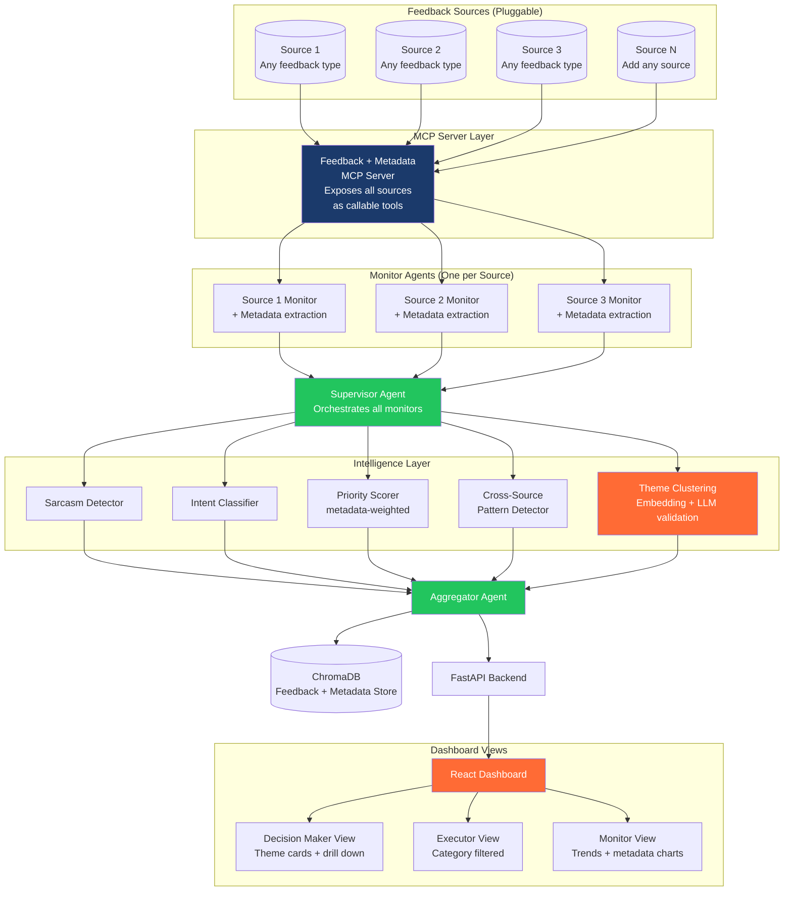

# Feedback Intelligence Agent
## Design Document

**Author:** Prasenjeet Jena  
**Date:** March 2026    
**Repository:** ai-agent-portfolio/projects/02-feedback-loop-agent  

---

## Vision

Every organisation receives feedback every day.

A product company gets app reviews and NPS surveys. 
A retail chain gets store complaints and mystery shopper reports. 
An enterprise gets employee surveys and partner feedback.

- The format is different. The source is different. But the problem is always the same:
- Too much feedback. 
- Too little intelligence. 
- Wrong priorities acted on. 
- Right priorities missed.

This agent is built to solve that — for any organisation, any feedback type, any source.

The v1 implementation uses product feedback as the demonstration use case. The architecture 
is designed from day one to plug into any feedback source without changing the core intelligence layer.

---

## Problem Statement

Organisations receive feedback from multiple channels simultaneously. Processing this feedback manually is slow, inconsistent, and does not scale.

Four specific problems drive this:

**Problem 1 — Volume**
Any organisation of meaningful size generates hundreds of feedback signals daily. Reading all of it manually is impossible. Critical signals get missed because no human can keep up with the volume.

**Problem 2 — Fragmentation**
The same issue often appears across multiple sources on the same day. A bug showing up in app reviews AND employee reports AND customer calls simultaneously is clearly urgent. But nobody connects these dots because each source lives in a different tool, owned by a different team, checked at a different time.

**Problem 3 — Poor signal quality**
Simple keyword tools and basic sentiment analysis fail on real-world feedback. Sarcasm, mixed sentiment, and requests hidden inside complaints all get misclassified. The result is wrong prioritisation — teams act on noise while real signals go unnoticed.

**Problem 4 — No intelligent prioritisation**
Even after correctly understanding all the feedback — which 10 things out of 500 should someone act on today? This decision currently happens on gut feel, not data. There is no system that reasons across all sources simultaneously and ranks by actual impact.

---

## User Personas

### Persona 1 — The Decision Maker

Could be a Product Manager, Store Manager, HR Lead, Customer Success Head, or Operations Director. This person needs to know what matters most — right now — without reading hundreds of raw feedback items.

**Current reality:**
- Manually checks each source separately. 
- Spends significant time just reading. 
- Cannot connect patterns across sources. 
- Makes prioritisation decisions from memory or gut feel.

**Pain:** "I know I am missing things. I just do not know what I am missing."

**What success looks like:**
- One dashboard. Top themes ranked by impact. 
- Clear reasoning for each. Drill down to individual items with full metadata. 
- Act immediately without reading 500 raw items.

---

### Persona 2 — The Executor

Could be an Engineer, Store Operations Team, HR Business Partner, or Support Team Lead. This person receives classified, prioritised items and acts on them.

**Current reality:**
- Receives a mixed list of feedback — bugs, requests, complaints, praise — all lumped together. 
- Wastes time separating what needs action from what does not.

**What success looks like:**
- Pre-classified items relevant to their domain. 
- Ranked by severity and frequency. 
- Ready to act without additional triage.

---

### Persona 3 — The Monitor

Could be a Customer Success Manager, Employee Relations team, or Quality Assurance Lead. This person watches trends over time and needs early warning of problems before they escalate.

**Current reality:**
Finds out about problems after they have already escalated. No visibility into sentiment trends until something breaks.

**What success looks like:**
- Sentiment trends over time. 
- Early escalation risk signals. 
- Week-over-week movement visible at a glance.

---

## Solution

An intelligent feedback processing system with five core capabilities:

**1. Universal ingestion**
- Connects to any feedback source through a pluggable MCP server architecture. 
- Adding a new source means adding one MCP tool — no changes to the agent logic.

**2. Deep understanding**
- Goes beyond keyword matching. 
- Understands sarcasm, mixed sentiment, true intent beneath surface words, and hidden requests disguised as complaints.

**3. Rich metadata capture**
- Every feedback item carries product context, user context, and feedback context. 
- Metadata is used to weight priority decisions and is visible on drill-down.

**4. Theme clustering**
- Instead of flagging 500 individual tickets, the system groups similar feedback into 10-15 themes. 
- Each theme has a name, description, aggregated metadata, and drill-down to individual items.

**5. Intelligent prioritisation**
- Scores every theme across multiple factors — severity, frequency, cross-source presence, user segment, ARR at risk, and escalation signals. 
- Surfaces the top themes daily.

---

## Architecture


---

## Metadata Architecture

Feedback text alone is not enough to make good decisions. The metadata attached to each feedback item is often what determines priority and action.

### Why Metadata Matters

- Two users report the same issue. 
- Without metadata they look identical.

Same complaint. Completely different priority. Metadata makes this decision possible.

### Universal Metadata Schema

Every feedback item regardless of source carries a standard metadata envelope:
```json
{
  "feedback_id": "unique identifier",
  "source": "which system it came from",
  "timestamp": "when it was submitted",

  "product_context": {
    "app_name": "which product",
    "app_version": "version number",
    "platform": "iOS / Android / Web / Desktop",
    "browser": "Chrome / Safari / Firefox if web",
    "browser_version": "version number",
    "os": "operating system",
    "os_version": "OS version",
    "device_type": "mobile / tablet / desktop",
    "device_model": "specific model if available"
  },

  "user_context": {
    "user_segment": "enterprise / SMB / consumer / free",
    "account_tenure_months": "how long they have been a customer",
    "subscription_tier": "free / pro / enterprise",
    "arr": "annual recurring revenue if available",
    "geography": "country or region",
    "language": "feedback language",
    "user_type": "power / casual / new"
  },

  "feedback_context": {
    "trigger": "what action preceded this feedback",
    "session_duration": "how long they were in the app",
    "feature_used": "which feature they were using",
    "previous_feedback_count": "have they complained before",
    "support_ticket_history": "past tickets if available"
  },

  "raw_content": {
    "text": "the actual feedback text",
    "rating": "star rating if applicable",
    "score": "NPS score if applicable",
    "attachments": "screenshots or files if any"
  }
}
```

### Source-Specific Metadata

Different sources contribute different metadata fields. Missing fields are handled gracefully - absent, not an error.

**App Store Reviews add:**
- Star rating (1-5)
- App version at time of review
- Device and OS from store metadata
- Country of reviewer
- Review response history

**NPS Surveys add:**
- NPS score (0-10)
- Survey trigger (what action prompted it)
- User tenure
- Subscription tier
- Feature being evaluated

**Sales Call Notes add:**
- Deal size and ARR
- Competitor mentions (yes/no + which)
- Churn risk flag
- Account health score

### Metadata in Priority Scoring

The priority scorer uses metadata to adjust scores:

| Metadata signal | Priority adjustment |
|----------------|-------------------|
| Enterprise customer | +15 points |
| High ARR account | +20 points |
| Churn risk flagged | +25 points |
| Recurring complainer | +10 points |
| New user (< 30 days) | +5 points |
| Outdated app version | -10 points |
| Isolated to one OS version | Noted — likely platform bug |
| Across multiple platforms | +15 points |

---

## How It Works — Step by Step

### Step 1 — Data Ingestion

Three Monitor Agents read from three mock data sources through MCP tools. 
Each agent reads only new items since the last run.

One Monitor Agent per source. Each is independent — can be added, removed, or updated separately without affecting others.

The MCP server exposes all sources as callable tools. Agents never access data sources directly.

---

### Step 2 — Understanding Each Item

Every item passes through three understanding checks:

**Sarcasm Detection**

The LLM reads full text with all available context — rating, source type, user history if available.

Sarcasm signals:
- Positive words paired with low rating
- Exaggerated praise for negative outcomes
- Ironic phrasing patterns
- Contradiction between tone and content

Output: sarcasm detected (yes/no), confidence (high/medium/low), true sentiment.

When confidence is LOW — item flagged for human review. Never auto-classify when uncertain.

**Intent Classification**

Surface sentiment and true intent are classified separately.

| What they wrote | True intent |
|----------------|-------------|
| "Why can't I do X?" | Feature request |
| "This used to work before" | Bug report |
| "I guess it's okay" | Low satisfaction signal |
| "Love everything except Y" | Mixed — complaint hidden in praise |
| "Took me 3 hours to find this" | UX problem |
| "Competitor X does this better" | Escalation signal |

**User Segment Identification**

Who is giving this feedback matters as much as what they are saying.

Segment identified from:
- Language specificity
- Rating history if available
- Source type metadata
- Subscription and tenure data

---

### Step 3 — Priority Scoring

Every item receives a score from 1 to 100.

| Factor | Weight | Reasoning |
|--------|--------|-----------|
| Severity | 30% | Bug more urgent than feature request |
| Frequency | 25% | One complaint is noise. Ten is a pattern. |
| Cross-source presence | 25% | Same issue in 2+ sources confirms it is real |
| User segment | 10% | Enterprise and high-ARR feedback weighted higher |
| Escalation signal | 10% | Churn, legal, safety, competitor mentions |

Metadata adjustments applied on top of base score as described above.

---

### Step 4 — Theme Clustering

This is the most important step.

Individual items are grouped into themes based on semantic similarity. 

The output is not 500 flagged tickets. 
The output is 10-15 themes — each representing a cluster of similar feedback — with evidence and metadata aggregated at the theme level.

See Theme Clustering section for full detail.

---

### Step 5 — Cross-Source Pattern Detection

The Supervisor Agent looks across all sources simultaneously.

Four pattern types detected:

**PATTERN FLAG**
Same issue in 2 or more sources.
Requirement: semantic similarity above 0.85 AND same intent classification.

**TREND ALERT**
Overall sentiment dropping across all sources over the last 7 days.

**EMERGING SIGNAL**
New category of feedback appearing for the first time.

**ANOMALY FLAG**
Sudden spike in one source only.

---

### Step 6 — Aggregation

The Aggregator Agent produces:

- Top 10-15 themes ranked by priority
- 7-day trend summary per source
- New patterns detected in last 24 hours
- Recommended action category per theme
- Escalation alerts surfaced immediately

---

### Step 7 — React Dashboard

Live dashboard with three views. 
See UI Design section for full detail.

---

## Theme Clustering

### What a Theme Is

A theme is a group of feedback items that share the same underlying issue, regardless of how differently each person described it.

User A: "App crashes when I try to export"
User B: "Export button does nothing on my phone"
User C: "Cannot get my data out, very frustrating"
User D: "Export has been broken for weeks"

These are four different pieces of feedback. 
They are one theme: Export Functionality Issue.

The agent clusters these together, names the theme, writes a description from the evidence, and presents them as one actionable item — not four separate tickets.

### Theme Structure
```json
{
  "theme_id": "theme_001",
  "theme_name": "Short descriptive name",
  "description": "2-3 sentence summary written 
                  from the evidence — specific 
                  not generic",
  "priority": "HIGH / MEDIUM / LOW",
  "category": "bug / feature_request / complaint 
               / praise / question / escalation",

  "evidence": {
    "total_items": 23,
    "sources": ["app_store", "nps_survey", "sales_call"],
    "date_range": "first seen to most recent",
    "trend": "increasing / stable / decreasing"
  },

  "metadata_summary": {
    "affected_platforms": ["iOS 16", "Android 13"],
    "affected_versions": ["v3.1", "v3.2"],
    "user_segments": {
      "enterprise": 8,
      "pro": 10,
      "free": 5
    },
    "geography": {
      "IN": 12,
      "US": 7,
      "UK": 4
    },
    "arr_at_risk": 340000,
    "churn_signals": 3
  },

  "agent_reasoning": "Why this priority level — 
                      specific reasoning from 
                      the evidence",

  "recommended_action": "engineering_fix / 
                         product_review / 
                         customer_outreach / 
                         monitor",

  "individual_items": [
    "List of all feedback IDs in this theme"
  ]
}
```

### How Clustering Works

**Step 1 — Embedding**
Every feedback item embedded using text-embedding-3-small. Captures semantic meaning — not keywords.

**Step 2 — Similarity grouping**
Items with embedding similarity above 0.80 are candidates for the same theme. Threshold is configurable.

**Step 3 — LLM validation**
Agent reads the candidate group and confirms: do these items actually describe the same underlying issue? 
If yes — one theme. 
If no — split into separate themes.

**Step 4 — Theme naming and description**
Agent writes theme name and 2-3 sentence description from the actual evidence. 
Specific — not generic.

**Step 5 — Metadata aggregation**
All metadata from individual items aggregated to theme level. 
Affected platforms, versions, user segments, and ARR at risk calculated from the individual items.

### Theme Limits

Maximum 30 themes shown per day.

Items that do not cluster into a theme with at least 3 items go into an "Other Signals" section — visible but not in the main priority view.

A Decision Maker reads the full dashboard in 5 minutes. Not 500 tickets.

### Drill-Down View

Clicking any theme opens a detail view showing all individual items in that theme — each with full metadata visible.
```
THEME: [Name identified by agent]
━━━━━━━━━━━━━━━━━━━━━━━━━━━━━━━━
23 feedback items · 3 sources · HIGH priority

Affected platforms: iOS 16 (18), Android 13 (5)
Affected versions: App v3.1 (20), v3.2 (3)
User segments: Enterprise (8) Pro (10) Free (5)
Geography: India (12), US (7), UK (4)
Average rating from this theme: 2.1 stars
ARR at risk: $340,000
Churn signals: 3

INDIVIDUAL ITEMS:
┌──────────────────────────────────────────┐
│ review_042 · App Store · iOS 16          │
│ Rating: ★★☆☆☆ · App v3.1 · Enterprise   │
│ "feedback text here"                     │
│ User: 18 months tenure · $45k ARR        │
└──────────────────────────────────────────┘
┌──────────────────────────────────────────┐
│ nps_018 · NPS Survey · iOS 16            │
│ Score: 4/10 · Trigger: post_export       │
│ "comment text here"                      │
│ User: 6 months tenure · Pro tier         │
└──────────────────────────────────────────┘
... remaining items ...
```

---

## The Hard Cases

### Sarcasm

Most feedback tools completely miss sarcasm. They score words, not meaning.

"This app is absolutely incredible at crashing every morning" — a keyword tool scores this as positive. The true meaning is a severe bug report from a frustrated user.

The agent reads context holistically. Positive words paired with negative outcomes or low ratings trigger sarcasm investigation. True sentiment recorded separately from surface words.

When confidence is LOW — item flagged for human review. System never guesses on uncertain sarcasm.

---

### Mixed Feedback

"I love the design but the performance is absolutely terrible."

A simple tool averages these into a neutral score — hiding both signals.

The agent splits mixed feedback into component parts. Each part classified and stored separately. Both signals reach the right team. Neither gets lost.

---

### Feature Requests Disguised as Complaints

This is the most commercially valuable hard case.

"Why can't I export to Excel?"
"It would be so much better if I could do bulk actions."
"I have to do this manually every time — why is this not automated?"

These look like complaints. They are feature requests from engaged users who care enough to articulate what they need.

Intent classifier identifies these. If the same hidden feature request appears 3 or more times across any source — automatic priority boost. Surfaces in top themes labelled: RECURRING FEATURE REQUEST.

---

### Escalation Signals

Some feedback requires immediate attention regardless of volume or frequency.

Automatic escalation flag on any mention of:
- Competitor evaluation or switching
- Cancellation or churn intent
- Legal or compliance concern
- Safety issue
- Data loss or security concern

Escalation items bypass normal priority scoring and appear at the top of the Decision Maker view immediately.

---

## Mock Data Design

> **Note:** The data below shows format 
> and structure only. Actual mock data 
> will be created before coding starts. 
> The agent discovers themes and patterns 
> autonomously. Outputs are not pre-engineered.

**Total: 100 items across 3 sources**

### Source 1 — App Store Reviews (50 items)
```json
{
  "feedback_id": "review_001",
  "source": "app_store",
  "timestamp": "2026-03-20T10:30:00Z",
  "raw_content": {
    "rating": 2,
    "text": "feedback text here"
  },
  "product_context": {
    "app_name": "MockApp",
    "app_version": "3.2.1",
    "platform": "iOS",
    "os_version": "16.2",
    "device_type": "mobile",
    "device_model": "iPhone 12"
  },
  "user_context": {
    "user_segment": "pro",
    "account_tenure_months": 8,
    "subscription_tier": "pro",
    "geography": "IN",
    "user_type": "power_user"
  },
  "feedback_context": {
    "trigger": "organic",
    "feature_used": "export"
  }
}
```

### Source 2 — NPS Survey Responses (30 items)
```json
{
  "feedback_id": "nps_001",
  "source": "nps_survey",
  "timestamp": "2026-03-20T14:15:00Z",
  "raw_content": {
    "score": 6,
    "text": "comment text here"
  },
  "product_context": {
    "app_name": "MockApp",
    "app_version": "3.2.0",
    "platform": "Web",
    "browser": "Chrome",
    "browser_version": "121"
  },
  "user_context": {
    "user_segment": "enterprise",
    "account_tenure_months": 14,
    "subscription_tier": "enterprise",
    "arr": 45000,
    "geography": "US",
    "user_type": "power_user"
  },
  "feedback_context": {
    "trigger": "post_export_attempt",
    "feature_used": "data_export",
    "previous_feedback_count": 2
  }
}
```

### Source 3 — Sales Call Notes (20 items)
```json
{
  "feedback_id": "sales_001",
  "source": "sales_call",
  "timestamp": "2026-03-20T16:00:00Z",
  "raw_content": {
    "text": "call notes here"
  },
  "product_context": {
    "app_name": "MockApp",
    "app_version": "latest"
  },
  "user_context": {
    "user_segment": "enterprise",
    "account_tenure_months": 24,
    "subscription_tier": "enterprise",
    "arr": 120000,
    "geography": "UK"
  },
  "feedback_context": {
    "trigger": "quarterly_review_call",
    "previous_feedback_count": 5
  },
  "sales_specific": {
    "deal_size": "enterprise",
    "escalation_risk": false,
    "competitor_mentioned": false,
    "churn_risk": false
  }
}
```

---

## MCP Server Design

The MCP server is the bridge between agents and data sources. Agents call tools. Tools return data. Agents never access data sources directly.

This is the production pattern. In v1 tools read mock JSON files. In production the same tools connect to real APIs — App Store Connect, Zendesk, Salesforce — without changing any agent code.

### Tools Exposed
```
get_feedback(source, since_date)
→ Returns all feedback from specified 
  source after the given date
  Includes full metadata per item

get_all_feedback(since_date)
→ Returns combined feedback from all 
  connected sources
  Includes full metadata per item

get_sources()
→ Returns list of all connected sources
  with item counts and last updated time

add_source(source_config)
→ Register a new feedback source
  Agent discovers and processes it 
  on next run automatically
```

### The add_source Tool — Extensibility Key

New sources register through add_source. 
No code changes needed to the agent, intelligence layer, or dashboard. 
The system discovers and processes the new source automatically.

### Supported Source Types

| Source Type | Examples |
|------------|---------|
| Product feedback | App Store, Google Play, NPS surveys |
| Customer feedback | Zendesk, Intercom, support tickets |
| Social feedback | Twitter/X, Reddit, community forums |
| Review platforms | G2, Capterra, Trustpilot, Yelp |
| Internal feedback | Employee surveys, HR tickets, Slack |
| Partner feedback | Sales call notes, partner submissions |
| Retail feedback | In-store forms, mystery shopper reports |

---

## UI Design

### Tech Stack
```
Frontend:  React + Tailwind CSS
Backend:   FastAPI (Python)
Agents:    LangGraph inside FastAPI
Storage:   ChromaDB + JSON files
API:       REST — React calls FastAPI
```

### Decision Maker View
```
┌──────────────────────────────────────────┐
│ 🔍 Feedback Intelligence                 │
│ Last updated: 2 min ago      [Refresh]   │
├──────────────────────────────────────────┤
│ TODAY AT A GLANCE                        │
│ 📊 100 items → 12 themes identified      │
│ 🚨 [N] escalation signals               │
│ 🔄 [N] cross-source patterns            │
│ 📈 Sentiment vs yesterday: [trend]       │
├──────────────────────────────────────────┤
│                                          │
│ THEME 1 🚨 ESCALATION                    │
│ [Theme name — written by agent]          │
│ 23 items · 3 sources · Trending up ↑    │
│ Priority: HIGH · Category: Bug           │
│                                          │
│ "[Agent-written description from         │
│  the actual evidence — specific]"        │
│                                          │
│ Platforms: iOS 16 (18) Android 13 (5)   │
│ Segments: Enterprise (8) Pro (10)        │
│ ARR at risk: $340,000                    │
│ Churn signals: 3                         │
│                                          │
│ Recommended action: Engineering fix      │
│ [View 23 items ↓] [Mark reviewed]        │
│                                          │
├──────────────────────────────────────────┤
│                                          │
│ THEME 2 ⚠️ HIGH PRIORITY                 │
│ [Theme name]                             │
│ 15 items · 2 sources · Stable →         │
│ Priority: HIGH · Category: Feature       │
│                                          │
│ "[Description]"                          │
│                                          │
│ Platforms: Web (12) Mobile (3)           │
│ Segments: Enterprise (15)                │
│ ARR at risk: $210,000                    │
│                                          │
│ [View 15 items ↓] [Mark reviewed]        │
│                                          │
├──────────────────────────────────────────┤
│ ... themes 3 through 15 ...              │
│                                          │
│ OTHER SIGNALS (items below threshold)    │
│ [N] ungrouped items · [View all]         │
└──────────────────────────────────────────┘
```

### Drill-Down View (clicking View items)

Expands inline to show all individual feedback items in that theme. Each item shows full metadata. Visible without leaving the dashboard.
```
THEME: [Name]
━━━━━━━━━━━━━━━━━━━━━━━━━━━━━━━━
23 items · 3 sources · HIGH priority

Affected platforms: iOS 16 (18) Android (5)
Affected versions: v3.1 (20) v3.2 (3)
User segments: Enterprise (8) Pro (10) Free (5)
Geography: India (12) US (7) UK (4)
ARR at risk: $340,000 · Churn signals: 3

▼ INDIVIDUAL ITEMS

┌──────────────────────────────────────────┐
│ review_042 · App Store · iOS 16          │
│ ★★☆☆☆ · App v3.1 · Enterprise           │
│ "feedback text"                          │
│ 18 months tenure · $45k ARR · India      │
└──────────────────────────────────────────┘

┌──────────────────────────────────────────┐
│ nps_018 · NPS Survey · Web · Chrome      │
│ Score: 4/10 · Trigger: post_export       │
│ "comment text"                           │
│ 6 months · Pro tier · US                 │
└──────────────────────────────────────────┘

... remaining items ...
```

### Executor View

Filtered by category relevant to executor.
Engineer sees: bugs only.
Support sees: complaints + questions.
Product sees: feature requests only.

Each item pre-classified and ranked by severity and frequency. Ready for action without additional triage.

### Monitor View
```
Sentiment trend — last 7 days
[Line chart per source]

Week-over-week movement
[Source comparison table]

Escalation risk items
[List with timestamps and ARR]

New patterns this week
[Pattern cards with evidence count]

Top themes by volume
[Bar chart]
```

---

## Success Metrics

| Metric | Target | How Measured |
|--------|--------|-------------|
| Sarcasm detection accuracy | >85% | Manual review of all sarcastic items |
| Intent classification accuracy | >80% | Manual review of all disguised requests |
| Theme clustering accuracy | >80% | Do grouped items actually belong together? |
| Decision Maker agreement with top themes | >75% | Does ranking match human judgement? |
| Cross-source pattern detection | >90% | Were all patterns in mock data found? |
| False pattern rate | <10% | Were non-patterns incorrectly flagged? |
| Dashboard load time | <3 seconds | Browser developer tools |

---

## Failure Modes

**Failure 1 — Sarcasm misclassified**
Subtle sarcasm without obvious signals gets treated as genuine positive feedback.
Mitigation: Low confidence items go to human review queue. Hard rule: never auto-classify when sarcasm confidence is below HIGH.

**Failure 2 — Priority inflation**
Agent marks too many themes as HIGH. Decision Maker stops trusting the system.
Mitigation: Hard cap of 10 HIGH priority themes per day. System must rank and select — not just flag everything.

**Failure 3 — Theme over-splitting**
Similar items split into too many themes. Decision Maker sees 40 themes instead of 15.
Mitigation: Similarity threshold configurable. LLM validation step merges related candidates. Maximum 30 themes enforced at output.

**Failure 4 — Theme under-splitting**
Unrelated items incorrectly grouped into one theme.
Mitigation: LLM validation reads each candidate group and confirms semantic coherence before creating theme.

**Failure 5 — Escalation signal missed**
Indirect churn or escalation language not caught.
Mitigation: Dedicated escalation detection runs separately from general classification. Competitor mentions, cancellation language, safety concerns — all trigger independent escalation check on every item.

**Failure 6 — Metadata missing**
Source does not provide expected metadata fields.
Mitigation: All metadata fields are optional. Missing fields handled gracefully. Priority scoring uses available fields only. Dashboard shows "not available" for missing data.

**Failure 7 — Dashboard stale**
Agent runs but UI does not update.
Mitigation: Auto-refresh every 60 seconds. Last updated timestamp always visible. Manual refresh always available.

---

## Cost Analysis

**Per daily run — 100 feedback items:**

| Action | Estimated Cost |
|--------|---------------|
| Classify 100 items (sarcasm + intent) | ~$0.05 |
| Theme clustering (embedding + validation) | ~$0.03 |
| Pattern detection | ~$0.02 |
| Aggregation and priority ranking | ~$0.01 |
| **Total per daily run** | **~$0.11** |

**Production projection:**

| Scale | Daily Items | Daily Cost | Monthly Cost |
|-------|------------|------------|-------------|
| Small organisation | 100 | ~$0.11 | ~$3.30 |
| Medium organisation | 1,000 | ~$1.10 | ~$33.00 |
| Large organisation | 10,000 | ~$11.00 | ~$330.00 |
| Enterprise | 100,000 | ~$110.00 | ~$3,300.00 |

---

## Technology Stack

| Component | Technology | Why |
|-----------|-----------|-----|
| Agent framework | LangGraph | Multi-agent with persistent shared state |
| LLM | GPT-4o-mini | Cost-effective for high-volume classification |
| Embeddings | text-embedding-3-small | Theme clustering and semantic search |
| MCP server | Python MCP SDK | Pluggable source architecture |
| Raw data storage | JSON files | Simple portable mock data for v1 |
| Vector storage | ChromaDB | Semantic search + feedback history |
| Backend API | FastAPI | Python API connecting agents to React |
| Frontend | React + Tailwind | Three persona views, production-grade |
| Observability | LangSmith | Full pipeline tracing per item |

---

## Out of Scope — Version 1

- Real API connections to live data sources
- User authentication and login
- Email or Slack notifications
- Auto-ticket creation in Jira or Linear
- Trend analysis beyond 7 days
- Multi-language feedback support
- Voice or audio feedback processing
- Scheduled automated runs
- Mobile application
- Role-based access control

---

## Future Integrations — v2 and Beyond

The pluggable MCP architecture supports any of these without changing the intelligence layer:
- App Store Connect API
- Google Play Developer API
- Zendesk API
- Salesforce CRM
- Twitter/X API
- Reddit API
- G2 / Capterra
- Slack API
- Microsoft Teams
- Workday / BambooHR
- Medallia / Qualtrics