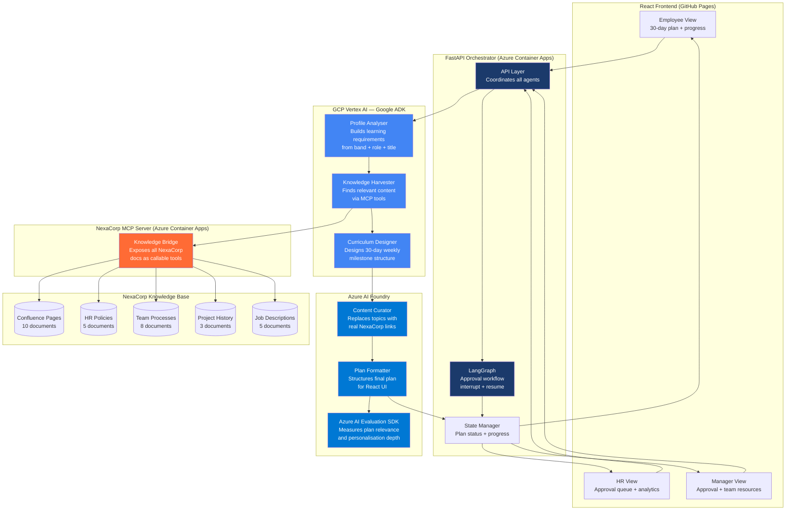

# OnboardIQ — Smart Employee Onboarding Platform
## Design Document

**Author:** Prasenjeet Jena
**Date:** May 2026
**Status:** Approved — design complete before coding starts
**Repository:** ai-agent-portfolio/projects/03-onboardiq

---

## Vision

Every company has the same onboarding problem.

A new employee joins. Their manager spends 5-10 hours manually 
pulling together a plan — digging through Confluence, Slack history, 
recorded meetings, HR portals, strategy docs scattered across a dozen 
places. The output is inconsistent, generic, and missing the 
institutional knowledge that lives only in people's heads.

The new employee gets a PDF and a calendar invite. 
Then they are on their own.

OnboardIQ solves this. An AI agent reads the new employee's profile — 
job title, position, band level — and automatically generates a 
personalised 30-day learning path. Company policies curated by HR. 
Team materials curated by the manager. All organised into a structured 
weekly milestone plan with mandatory and optional items clearly marked.

HR approves the company layer. The manager approves the team layer. 
Both in parallel. When both approve — the employee sees their plan 
and starts Day 1.

---

## The Problem

### What Happens Today at a Company Like NexaCorp

A new Senior Data Scientist joins the Analytics team.

Their manager gets a calendar invite: "Onboarding prep — new hire 
starts Monday."

The manager opens Confluence and starts searching. Company policies — 
HR portal. Team processes — Engineering wiki. Current projects — 3 
different repos and a Notion board. Decision history — buried in old 
meeting notes and Slack threads. Strategy context — last quarter's 
OKR doc somewhere in Google Drive.

5 hours later they have a rough document. It covers maybe 60% of 
what the new hire actually needs. The other 40% comes out in ad-hoc 
conversations over the first two weeks — if the manager has time, 
if the new hire asks the right questions.

**The cost:**
- Manager loses 1-2cday per new hire
- New hire spends first two weeks asking questions that should have 
  been answered in documentation
- Institutional knowledge that lives in people's heads never gets 
  surfaced
- Every new hire gets a slightly different onboarding depending on 
  how busy their manager was that week

### The Specific Gaps OnboardIQ Fills

**Gap 1 — Personalisation by band and role**
A Junior joining as a Data Analyst needs foundational guides, team 
process walkthroughs, and introductory project context. A Senior 
joining as a Data Science Lead needs strategic OKR context, 
architecture decision records, and team dynamics — not SQL basics. 
Today both get roughly the same plan because the manager does not 
have time to personalise deeply.

**Gap 2 — Scattered knowledge sources**
Relevant content exists across Confluence, GitHub, HR portals, and 
recorded meetings. No manager has time to pull from all of them 
systematically. OnboardIQ does this automatically.

**Gap 3 — No structure or accountability**
Today's onboarding plans are documents. No timeline enforcement. 
No warnings when someone falls behind. No visibility for the manager 
on whether the new hire is actually completing their onboarding. 
OnboardIQ turns a document into a tracked learning path.

**Gap 4 — Inconsistency**
Every manager curates differently. HR policies get included or missed 
depending on the manager's memory. OnboardIQ enforces consistency — 
every new hire gets every mandatory item, every time.

---

## NexaCorp — The Demo Company

NexaCorp is a fictional data and market intelligence SaaS company 
modelled on companies like NielsenIQ. They help consumer goods brands 
understand market trends, track competitor performance, and make 
data-driven decisions.

**Size:** 200 people
**Industry:** Data and market intelligence SaaS
**Teams:** Engineering, Data Science, Product, Sales, 
           Customer Success, HR, Operations

**Tech stack (for context in mock docs):**
- Engineering: Python, React, AWS, Snowflake, dbt
- Data Science: Python, R, Jupyter, MLflow, Vertex AI
- Product: Jira, Confluence, Figma, Notion
- Company-wide: Slack, Google Workspace, Workday, Okta SSO

**Band levels:**
- Band 1 — Junior (0-3 years experience)
- Band 2 — Mid-level (3-7 years experience)
- Band 3 — Senior/Lead (7+ years, strategic scope)

---

## User Personas

### Persona 1 — Anika, New Employee (Band 2 Data Scientist)

**Situation:** Joining NexaCorp's Analytics team from a competitor. 
5 years experience. Knows data science but does not know NexaCorp's 
processes, tools, current projects, or team culture.

**What she needs on Day 1:**
To understand what she has to complete and by when. Not to be 
overwhelmed. A clear structured path she can follow without asking 
her manager every hour.

**What success looks like:**
Opens OnboardIQ on Day 1. Sees her personalised 30-day plan. 
Understands Week 1 priorities immediately. Knows which items are 
mandatory vs optional. Starts her first item within the first hour.

**What frustrates her today:**
"My manager sent me a Google Doc with 40 links and no order. 
I do not know where to start or what is actually important."

---

### Persona 2 — Rahul, Hiring Manager (Analytics Team Lead)

**Situation:** His team is growing. He onboards 2-3 people per 
quarter. Each onboarding prep takes half a day he does not have.

**What he needs:**
To review a pre-generated plan for his new hire, confirm the 
team-specific content is correct, add anything missing, and approve 
— in under 30 minutes.

**What success looks like:**
Gets a notification that a plan has been generated for Anika. 
Opens the manager view. Reviews the team-specific sections. 
Adds one internal project link he knows is relevant. 
Approves. Done in 20 minutes.

**What frustrates him today:**
"I copy-paste the same onboarding doc every time and update the 
name. It takes forever and I always forget something."

---

### Persona 3 — Priya, HR Business Partner

**Situation:** Manages onboarding for the entire company. Needs to 
ensure every new hire gets every mandatory company policy regardless 
of team or role.

**What she needs:**
To verify that all mandatory HR policies are included in every 
generated plan. Approve the company layer quickly. Track completion 
rates across all new joiners.

**What success looks like:**
Gets notification that a plan needs HR approval. Opens HR dashboard. 
Sees company policies are all tagged correctly. Approves in 5 minutes. 
Dashboard shows her all active onboarding plans and completion status.

**What frustrates her today:**
"Managers forget to include the code of conduct or the data privacy 
policy. I find out when someone does something wrong, not before."

---

## Solution Overview

OnboardIQ has three layers:

**Layer 1 — Intelligence (GCP Vertex AI + Google ADK)**
Three reasoning agents running on GCP:
- Profile Analyser: reads employee profile, builds learning 
  requirements map
- Knowledge Harvester: pulls relevant content from NexaCorp 
  knowledge base via MCP
- Curriculum Designer: designs week-by-week 30-day learning path

**Layer 2 — Compliance and Formatting (Azure AI Foundry)**
Two agents running on Azure:
- Content Curator: replaces topic names with real clickable 
  NexaCorp links
- Plan Formatter: structures the final plan into the schema 
  the React UI reads

**Layer 3 — Orchestration and Approval**
FastAPI on Azure Container Apps coordinates all agents across 
both clouds. LangGraph manages the parallel approval workflow 
with interrupt(). React frontend reads from FastAPI — never 
directly from agents.

---

## Architecture

---

## How It Works — Step by Step

**STEP 1 — HR triggers onboarding**
HR logs into OnboardIQ. Enters new employee details:
- Full name
- Job title
- Band level (1, 2, or 3)
- Team they are joining
- Start date

System creates employee profile. Triggers plan generation automatically.

**STEP 2 — Profile Analyser (GCP)**
Reads the employee profile.
Outputs a learning requirements map covering:
- Mandatory company-level items for all employees
- Mandatory team-level items for their specific team
- Recommended items based on band level
- Items to skip based on band level

**STEP 3 — Knowledge Harvester (GCP via MCP)**
Takes the learning requirements map.
Calls NexaCorp MCP server tools to find relevant content 
for each requirement.
Returns: content title, source, section, summary, link, 
relevance score.

**STEP 4 — Curriculum Designer (GCP)**
Takes requirements and harvested content.
Designs week-by-week structure:
Week 1 (Days 1-7):   Company Orientation
Week 2 (Days 8-14):  Team Integration
Week 3 (Days 15-21): Project Context
Week 4 (Days 22-30): Independent Contribution

Each week has a milestone. Employee can complete early.
Everything must be done by Day 30.

**STEP 5 — Content Curator (Azure)**
Takes curriculum structure with topic names.
Replaces every topic name with actual NexaCorp document links.
Tags every item: mandatory or optional.

**STEP 6 — Plan Formatter (Azure)**
Structures the final plan into clean JSON.
Calculates deadlines based on start date.
Sets up warning trigger thresholds.
Passes to approval workflow.

**STEP 7 — Parallel Approval (LangGraph interrupt)**
Two approval requests created simultaneously:

HR approval:
- Verifies all mandatory company policies are included
- Can add missing mandatory policies
- Approves or rejects with comments

Manager approval:
- Verifies team-specific content is correct and complete
- Can add resources, remove irrelevant items, add notes
- Approves or rejects with comments

Both must approve before employee sees plan.
Plan waits in pending state until both approve.

**STEP 8 — Employee sees plan**
Employee logs in on Day 1.
Sees personalised learning path.
Week 1 expanded by default — today's items highlighted.
Each item shows: title, mandatory/optional, time estimate, 
deadline, link.

**STEP 9 — Warning and escalation**
Daily completion check runs automatically.
Warnings go to employee if falling behind.
If mandatory items not complete by Day 30 — 
notification sent to manager.

---

## Band Level Personalisation

### Band 1 — Junior

- More foundational content (tools, processes, how things work)
- Longer time estimates per item
- More mandatory items — needs more structure
- Week 1-2 heavier on company and team basics
- Less strategic context

Unique items:
- Getting started with NexaCorp data stack (intro guide)
- How our sprint process works (detailed walkthrough)
- Your first week checklist (step by step)
- Environment setup guides

### Band 2 — Mid-level

- Balanced between process and context
- Mix of foundational and strategic content
- Expected to ramp faster — shorter time estimates
- Past project retrospectives included
- Architecture decisions relevant to their work

Unique items:
- Last 3 quarters project retrospectives
- Cross-team collaboration norms
- How we make product and data decisions
- Current OKRs and team contribution

### Band 3 — Senior/Lead

- Foundational content skipped — assumed they know
- Heavy strategic context
- Architecture decision records from last 12 months
- Team dynamics and stakeholder map
- Expected to contribute by end of Week 2

Unique items:
- NexaCorp 3-year product strategy
- Engineering and data architecture decisions — last 12 months
- Stakeholder map — who makes what decisions
- Current company OKRs and team contribution
- Key relationships to build in first 30 days

---

## NexaCorp Knowledge Base

All documents stored as mock files.
MCP server exposes them as callable tools.

### Confluence Pages (10)

1. NexaCorp — Company Overview and Mission
2. Engineering Team — How We Work
3. Data Science Team — Processes and Standards
4. Product Team — Ways of Working
5. IT Setup Guide — Tools, Access, Security
6. Cross-Team Collaboration Norms
7. Architecture Decision Records — Last 12 Months
8. Current Quarter OKRs — All Teams
9. Onboarding Checklist — All New Joiners
10. Stakeholder Map — Who Owns What

### HR Policies (5)

1. Code of Conduct
2. Data Privacy and Security Policy
3. Leave Policy
4. Expense and Travel Policy
5. Learning and Development Budget

### Team Process Docs (8)

1. Sprint Planning Process
2. PR Review Standards
3. Data Quality Standards
4. Incident Response Process
5. Release and Deployment Process
6. On-Call Rotation
7. Design and Architecture Review Process
8. Monitoring and Alerting Guide

### Project History (3)

1. Project Meridian — Last Quarter (completed)
2. Project Atlas — Current (active)
3. Project Horizon — Upcoming (planning)

### Job Descriptions (5)

1. Junior Data Analyst (Band 1)
2. Data Scientist (Band 2)
3. Senior Data Scientist / Lead (Band 3)
4. Junior Frontend Engineer (Band 1)
5. Senior Software Engineer (Band 3)

---

## MCP Server Design

The MCP server sits between the agents and the NexaCorp 
knowledge base. Agents call tools. Tools return documents. 
Agents never access files directly.

### Tools Exposed
get_confluence_pages(team, topic, band_level)
→ Returns relevant Confluence pages
filtered by team and topic
Band level determines depth of content returned
get_hr_policies(category, mandatory)
→ Returns HR policies
mandatory=true returns only required policies
get_team_processes(team, role)
→ Returns team process documents
filtered by team and role relevance
get_project_history(team, timeframe)
→ Returns project history documents
timeframe: "last_quarter" / "current" / "upcoming"
get_job_description(title, band_level)
→ Returns job description for role
Used by Profile Analyser to understand
role expectations
get_org_chart()
→ Returns NexaCorp org structure
Used to build stakeholder map for Band 3
get_company_okrs(quarter)
→ Returns company OKRs for specified quarter
Used for Band 2 and Band 3 plans

### Why MCP Here

In production OnboardIQ would connect to real Confluence API, 
real Workday, real GitHub, real HR systems via MCP tools. 
Swap mock documents for real API calls without changing 
any agent code. The agents only know about the tools — 
not where the data comes from.

---

## Warning and Escalation System
FALLING BEHIND:
Employee not on pace for weekly milestone.
→ In-app warning to employee only.
No manager notification.
WEEKLY MILESTONE MISSED:
Employee did not complete milestone by
weekly deadline but time remains.
→ Warning to employee only.
Still no manager notification.
FINAL DAY — MANDATORY ITEMS INCOMPLETE:
Employee reaches Day 30 with mandatory
items not completed.
→ Notification to manager:
"[Name] has not completed [N] mandatory
onboarding items by their 30-day deadline."
→ HR dashboard flags plan as incomplete.
→ Employee account stays active.
They can still complete items after Day 30.
Maximum one warning per week to avoid
warning fatigue.

---

## UI Design

### Tech Stack
Frontend:  React + Tailwind CSS
Deployed: GitHub Pages (free)
Backend:   FastAPI (Python)
Deployed: Azure Container Apps
(free tier — scales to zero)
Agents:    GCP Vertex AI — Google ADK
Azure AI Foundry
MCP:       Python MCP SDK
Deployed: Azure Container Apps
alongside FastAPI

### Employee View
┌─────────────────────────────────────────┐
│ 👋 Welcome, Anika                       │
│ Data Scientist · Band 2 · Analytics     │
│ Start date: March 25, 2026              │
├─────────────────────────────────────────┤
│ YOUR 30-DAY LEARNING PATH               │
│                                         │
│ Overall progress: ████░░░░ 12%          │
│ Days remaining: 26                      │
│ Mandatory items: 8/22 complete          │
├─────────────────────────────────────────┤
│ WEEK 1 — Company Orientation ← current │
│ Milestone deadline: March 31            │
│ Status: On track ✅                     │
│                                         │
│ ▼ Day 1-2 (Today)                       │
│                                         │
│ ✅ NexaCorp Mission and Values          │
│    🔴 Mandatory · 20 min · Completed   │
│    [confluence.nexacorp.com/mission]    │
│                                         │
│ ⬜ Code of Conduct                      │
│    🔴 Mandatory · 30 min · Due today   │
│    [hr.nexacorp.com/code-of-conduct]   │
│                                         │
│ ⬜ IT Setup Guide                       │
│    🔴 Mandatory · 45 min · Due today   │
│    [confluence.nexacorp.com/it-setup]  │
│                                         │
│ ⬜ NexaCorp Slack Guide                 │
│    🟡 Optional · 15 min                │
│    [confluence.nexacorp.com/slack]     │
│                                         │
│ ▶ Day 3-4                               │
│ ▶ Day 5-7                               │
│ ▶ WEEK 2 — Team Integration             │
│ ▶ WEEK 3 — Project Context              │
│ ▶ WEEK 4 — Independent Contribution    │
└─────────────────────────────────────────┘

### HR View
┌─────────────────────────────────────────┐
│ HR Dashboard — Onboarding Management   │
├─────────────────────────────────────────┤
│ PENDING APPROVAL (2)                    │
│                                         │
│ Anika Sharma · Data Scientist · Band 2  │
│ Analytics Team · Starts March 25        │
│                                         │
│ Company policies included:              │
│ ✅ Code of Conduct                      │
│ ✅ Data Privacy Policy                  │
│ ✅ Leave Policy                         │
│ ✅ Expense Policy                       │
│ ⚠️ L&D Budget — not included           │
│                                         │
│ [Add L&D Budget] [Approve] [Reject]     │
├─────────────────────────────────────────┤
│ ACTIVE ONBOARDING (8)                   │
│ Name · Role · Start · Progress · Status │
├─────────────────────────────────────────┤
│ OVERDUE — Final day passed (1)          │
│ [Employee] · 3 mandatory items incomplete│
│ Manager notified ⚠️                    │
└─────────────────────────────────────────┘

### Manager View
┌─────────────────────────────────────────┐
│ Manager Dashboard — Rahul Sharma        │
│ Analytics Team Lead                     │
├─────────────────────────────────────────┤
│ PENDING YOUR APPROVAL (1)               │
│                                         │
│ Anika Sharma · Data Scientist · Band 2  │
│                                         │
│ Team items included:                    │
│ ✅ Sprint Planning Process              │
│ ✅ Data Quality Standards               │
│ ✅ Project Atlas — Current Project      │
│ ✅ Project Meridian — Last Quarter      │
│ ✅ Analytics Team Norms                 │
│                                         │
│ [+ Add Confluence link]                 │
│ [+ Add GitHub repo]                     │
│ [+ Add note]                            │
│                                         │
│ [Approve] [Reject with comments]        │
├─────────────────────────────────────────┤
│ YOUR TEAM — ACTIVE ONBOARDING           │
│                                         │
│ Anika · Day 3 of 30 · On track ✅      │
│ Progress: 4/22 items                    │
│                                         │
│ Raj · Day 18 of 30 · ⚠️ Behind         │
│ 2 mandatory items overdue               │
└─────────────────────────────────────────┘

---

## Success Metrics

| Metric | Target | How Measured |
|--------|--------|-------------|
| Plan generation time | Under 3 minutes | FastAPI timing |
| Plan relevance score | >80% | Azure AI Evaluation SDK |
| Personalisation depth | >60% different across bands | Content overlap analysis |
| HR approval time | Under 10 minutes | Timestamp difference |
| Manager approval time | Under 20 minutes | Timestamp difference |
| Mandatory completion rate | >90% by Day 30 | Progress tracking |

---

## Failure Modes

**Failure 1 — Profile too sparse**
Job title and band alone do not always uniquely identify needs.
Mitigation: Agent uses team context to disambiguate. Defaults to 
broader content set for that band if unclear.

**Failure 2 — MCP returns irrelevant content**
Knowledge Harvester pulls content that exists but is not relevant.
Mitigation: Relevance grader checks every document against learning 
requirements map. Low relevance items excluded before Curriculum 
Designer runs.

**Failure 3 — Approval bottleneck**
HR or Manager does not review for several days.
Mitigation: Employee sees "Plan being reviewed" state with estimated 
approval time. Can browse in preview mode but cannot mark complete 
until approved.

**Failure 4 — Plans not genuinely personalised**
Band 1 and Band 3 plans are too similar.
Mitigation: Azure AI Evaluation SDK measures personalisation depth. 
If overlap too high — prompt refined until plans are genuinely 
different across bands.

**Failure 5 — Warning fatigue**
Too many warnings make employee ignore them all.
Mitigation: Maximum one warning per week. Warning only fires if 
meaningfully behind — not for missing one optional item.

**Failure 6 — Cross-cloud latency**
GCP and Azure agents communicating through FastAPI adds latency.
Mitigation: FastAPI runs async calls where possible. GCP reasoning 
agents run first — output cached before Azure agents start. 
Target: full generation under 3 minutes.

---

## Cost Analysis

### Per Plan

| Service | Free Tier | Cost Per Plan |
|---------|-----------|--------------|
| GCP Vertex AI | $300 credit | ~$0.05 |
| Azure AI Foundry | $200 credit | ~$0.03 |
| Azure Container Apps | 180k vCPU-sec/month free | ~$0.00 |
| GitHub Pages | Free | $0.00 |
| **Total per plan** | | **~$0.08** |

### Production Projection

| Scale | Plans/month | Monthly Cost |
|-------|------------|-------------|
| Small company (50 people) | 5 | ~$0.40 |
| Medium company (500 people) | 50 | ~$4.00 |
| Enterprise (5,000 people) | 500 | ~$40.00 |

---

## Technology Stack

| Component | Technology | Cloud | Why |
|-----------|-----------|-------|-----|
| Profile Analyser | Google ADK | GCP Vertex AI | Reasoning-heavy |
| Knowledge Harvester | Google ADK | GCP Vertex AI | Multi-step retrieval |
| Curriculum Designer | Google ADK | GCP Vertex AI | Structured reasoning |
| Content Curator | Azure AI Foundry | Azure | Compliance layer |
| Plan Formatter | Azure AI Foundry | Azure | Eval SDK integration |
| Approval Workflow | LangGraph interrupt() | Azure Container Apps | Parallel state management |
| MCP Server | Python MCP SDK | Azure Container Apps | Knowledge bridge |
| Orchestrator | FastAPI | Azure Container Apps | Cross-cloud coordination |
| Frontend | React + Tailwind | GitHub Pages | Three persona views |
| Evaluation | Azure AI Eval SDK | Azure | Plan quality measurement |
| Observability | LangSmith | Cloud-agnostic | Full trace across clouds |

---

## Out of Scope — Version 1

- Real Confluence or Workday API connections
- Email or Slack notifications (mock only)
- Mobile application
- Multi-language support
- Video or audio content in learning paths
- Peer buddy assignment
- Calendar integration
- Real SSO integration
- Multi-company support

---

