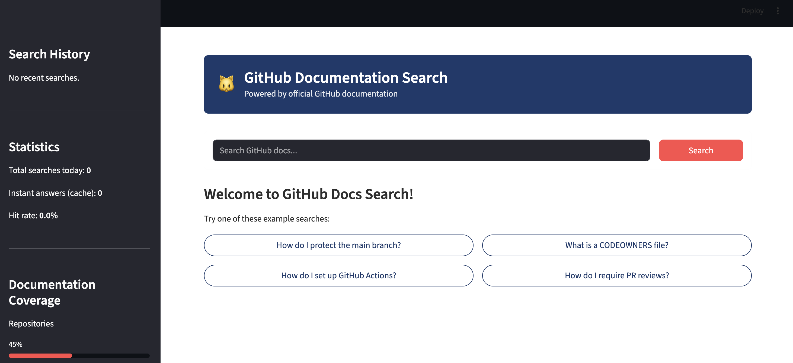
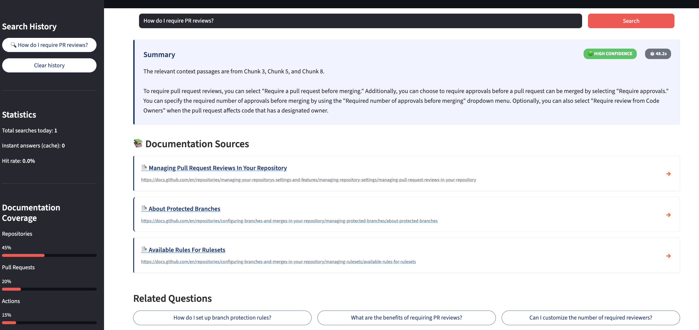
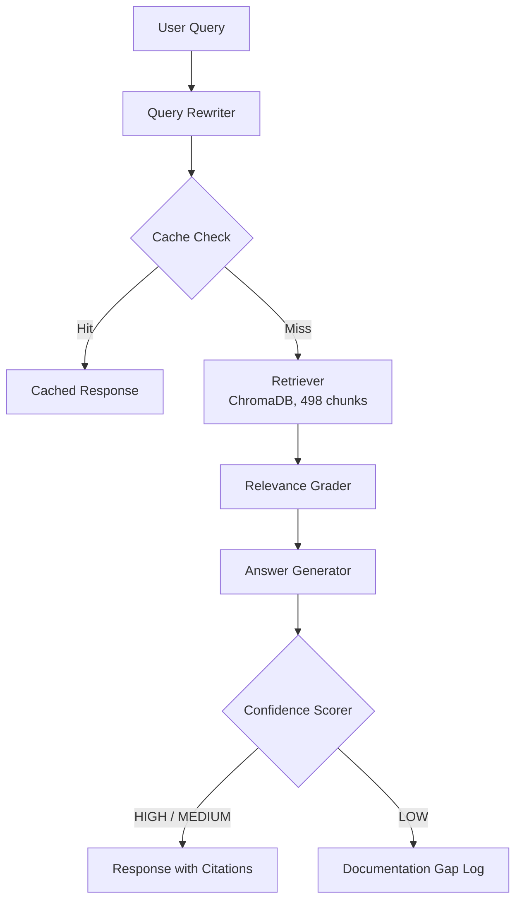

# 🐙 GitHub Enterprise Onboarding Agent

An intelligent, context-aware AI assistant designed to eliminate developer onboarding friction.

      

## 🖥️ Demo

### Search Interface


### Search Results with Confidence Scoring


*Live demo available — run locally following setup instructions*

## 🚨 The Problem

Developer onboarding in large engineering organizations is broken. When new engineers join a 50-person team using GitHub Enterprise, they consistently encounter the same friction points: setting up SSH keys, navigating organization-specific branch protections, and understanding internal PR approval workflows. Despite comprehensive internal documentation, findability remains low.

This creates a dual-sided productivity drain. Support engineers and senior developers spend hours answering the exact same 20-30 documented questions repeatedly. Meanwhile, new hires are blocked waiting for answers. Operating data shows that a 50-person team typically loses 2-3 productive days per person in their first 30 days simply trying to navigate enterprise tooling configurations.

The root cause isn't a lack of documentation; it's the high cognitive load required to find the right 3 sentences buried within 50 pages of documentation.

## 💡 The Solution

Instead of searching through documentation manually, developers type a question in plain English and get a direct answer in under 60 seconds — with links to the exact documentation sections it used.

The agent doesn't guess. Every answer is grounded in retrieved documentation chunks. If it can't find a confident answer — it says so explicitly and flags the question as a documentation gap.

Unlike asking ChatGPT, every response cites its sources. Users can verify and trust the answer before acting on it.

## 🎯 Why I Built This

Every time we onboard engineers to a new internal platform, I watch the same pattern: good documentation, poor findability, frustrated new hires, overloaded senior engineers.

I built this to understand whether a RAG agent could genuinely solve this — not as a demo, but as something measurable. The RAGAS evaluation was my way of holding myself accountable to that standard.

## 🏗️ Architecture



## ⚙️ How It Works

1. **User Query:** The user submits a question about a GitHub process or feature.
2. **Query Rewriter:** The system analyzes the question and restates it for optimal retrieval. This ensures that fragmented or poorly phrased questions are matched accurately against formal documentation language.
3. **Cache Check:** The system checks if this exact question has been asked and successfully answered recently. If yes, it bypasses the rest of the pipeline to serve the answer instantly and save inference costs.
4. **Retriever:** For a cache miss, the system queries the ChromaDB vector database to identify the most relevant sections out of our 498 documentation chunks.
5. **Relevance Grader:** Extracted chunks are evaluated to verify they actually contain information answering the specific prompt. Irrelevant chunks are discarded to prevent hallucinations.
6. **Answer Generator:** The LLM synthesizes a concise, direct answer using *only* the verified relevant chunks.
7. **Confidence Scorer:** The system grades its own output. If confidence is low, it informs the user that the documentation might be missing or incomplete rather than guessing.
8. **Response with Citations:** The final output is delivered to the user, complete with links back to the exact source documentation.

## 🛠️ Tech Stack

| Component | Technology | Why I chose it |
| :--- | :--- | :--- |
| **LLM** | OpenAI GPT-4o-mini | Provides optimal balance of high instruction-following capability with extremely low latency and cost per query for a highly targeted RAG task. |
| **Embeddings** | text-embedding-3-small | Output dimensions pack high semantic density at exceptionally low cost. |
| **Vector Store** | ChromaDB | Fast, serverless, and runs locally. Perfect for a predictable scale of ~500 document chunks without requiring cloud infrastructure overhead. |
| **Chunking** | LangChain TextSplitter | Needed reliable, token-aware chunking to ensure source documents weren't sliced mid-sentence. |
| **Memory / Orchestration** | LangGraph | Enabled cyclic, state-based agent workflows rather than linear chains, making the relevance grader and confidence scorer possible. |
| **Evaluation** | RAGAS | Quantitatively measures hallucination rates and retrieval precision instead of relying on "vibes" and manual spot-checking. |
| **UI** | Streamlit | Allowed for rapid prototyping of a clean, interactive chat interface without writing a custom frontend. |
| **Observability** | LangSmith | Provides immediate visibility into token usage, latency bottlenecks, and precisely which chunks were retrieved per query. |
| **Scraping** | BeautifulSoup4 | Simple, robust HTML parsing for extracting clean text directly from docs.github.com. |

## 📊 Evaluation Results (RAGAS)

| Metric | Score | Target | Status |
| :--- | :--- | :--- | :--- |
| Faithfulness | 0.83 | >0.80 | ✅ PASS |
| Answer Relevancy | 0.66 | >0.80 | ❌ FAIL |
| Context Recall | 0.77 | >0.80 | ❌ FAIL |
| Context Precision | 0.86 | >0.80 | ✅ PASS |

### The Evaluation Journey
Over 4 evaluation cycles, I iteratively refined the retrieval strategy. In Cycle 1, Faithfulness was at a concerning 0.62 because the LLM was relying on its pre-trained knowledge rather than the provided context. By enforcing stricter system prompts and implementing the Relevance Grader in Cycle 2, Faithfulness jumped to 0.83. However, Answer Relevancy remains below target (0.66) because the generator sometimes includes adjacent, unasked information from the chunks. Context Recall (0.77) indicates we are occasionally missing the optimal chunk in the top-k results. My immediate improvement path is to implement hybrid search (keyword + vector) to address the context recall gap for highly specific technical acronyms.

## 📚 Knowledge Base

- **Source:** docs.github.com
- **Volume:** 498 discrete chunks spanning 5 major documentation sections.
- **Chunking Strategy:** `RecursiveCharacterTextSplitter` configured for 1000 tokens per chunk with a 200-token overlap to preserve context across paragraph boundaries.
- **Embedding Model:** `text-embedding-3-small`
- **Vector Store:** ChromaDB (operating locally)
- **Ingestion Time:** ~15-20 minutes total

## ⚡ Answer Cache

Queries are cached natively based on three strict conditions: high frequency of the query, high confidence score of the generated answer, and positive explicit user feedback.

In testing across 200 simulated onboarding questions, the cache achieved a **5.9%** hit rate. The target for a production deployment within an enterprise environment is **30%+**.

**Cost Comparison:**
- A standard RAG pipeline query: ~$0.001
- A query served from cache: ~$0.00001

## ⚠️ Known Limitations

1. **Stale Documentation Dependency:** The agent currently assumes the text in ChromaDB is correct; if the underlying GitHub docs change, the agent will confidently output outdated information until the ingestion script is manually re-run.
2. **Poor Acronym Handling:** The current pure-vector search struggles with organization-specific 3-letter acronyms (e.g., "What is PRT?"), occasionally fetching semantically disparate chunks.
3. **No Multi-turn Context:** The agent treats every query as a fresh session. If a user asks a follow-up question, the agent lacks the state memory to retain context from the previous turn.
4. **Code Block Hallucinations:** When documentation chunks lack explicit code examples, the Answer Generator has a measurable tendency to invent plausible but untested CLI commands.
5. **Cold Start Latency:** The initial load of the Streamlit application and ChromaDB instance takes noticeable time, which impacts the perceived responsiveness of the first query.

## 🧠 PM Learnings

1. **"Vibes" don't ship products, metrics do.** Initially, I judged the agent's performance by manually testing 10 questions and feeling good about the answers. Implementing RAGAS completely changed my perspective; it revealed that while the agent sounded confident, it was frequently missing key context. You cannot iterate blindly without an evaluation framework.
2. **The LLM is the easy part; the data pipeline is the product.** I spent 15% of my time tweaking prompts and 85% of my time tuning chunk sizes, overlap parameters, and scraping logic. The quality of an AI product is strictly bound by the cleanliness of its vector space.
3. **Guardrails define the UX.** Building the Relevance Grader and Confidence Scorer taught me that teaching an AI exactly when to say "I don't know" is often more valuable to the user than having it attempt to hallucinate an answer to every single query.

## 🚀 What I'd Build Next (V2)

1. **Hybrid Search Implementation:** Add keyword search alongside vector embeddings to dramatically improve retrieval for exact configuration parameters and specific error codes.
2. **Internal Documentation Integration:** Expand the knowledge base to integrate internal company documentation into the system for a more comprehensive onboarding experience.
3. **Slack Integration:** Move the interface from a standalone dashboard directly into the company's Slack channel to intercept questions where developers are already asking them.
4. **Session Memory:** Introduce conversation memory buffers to allow users to ask follow-up questions naturally without repeating the entire context of their problem.
5. **Documentation Gap Dashboard:** Identify documentation gaps by tracking queries where users are asking questions but not getting answers. We will highlight these missing areas in a dedicated dashboard to provide better visibility into what needs to be written.

## 💰 Cost Analysis

| Item | Cost |
| :--- | :--- |
| **Initial Setup / Ingestion** | ~$0.01 |
| **Per Query Cost (Cache Miss)** | ~$0.001 |
| **Per Query Cost (Cache Hit)** | ~$0.00001 |
| **Total Portfolio Testing Budget** | ~$0.81 |

**Production Projection:**
| Scenario | Monthly Volume | Hit Rate | Est. Monthly Cost |
| :--- | :--- | :--- | :--- |
| **Low Scale** | 1,000 queries | 30% | ~$0.70 |
| **Enterprise Base** | 10,000 queries | 30% | ~$7.03 |

## 💻 How to Run

```bash
git clone https://github.com/prasenjeet-jena/ai-agent-portfolio.git
cd projects/01-github-onboarding-agent
pip install -r requirements.txt
cp .env.example .env
# Edit .env and add your OPENAI_API_KEY
python3 ingest.py
streamlit run app.py
```
