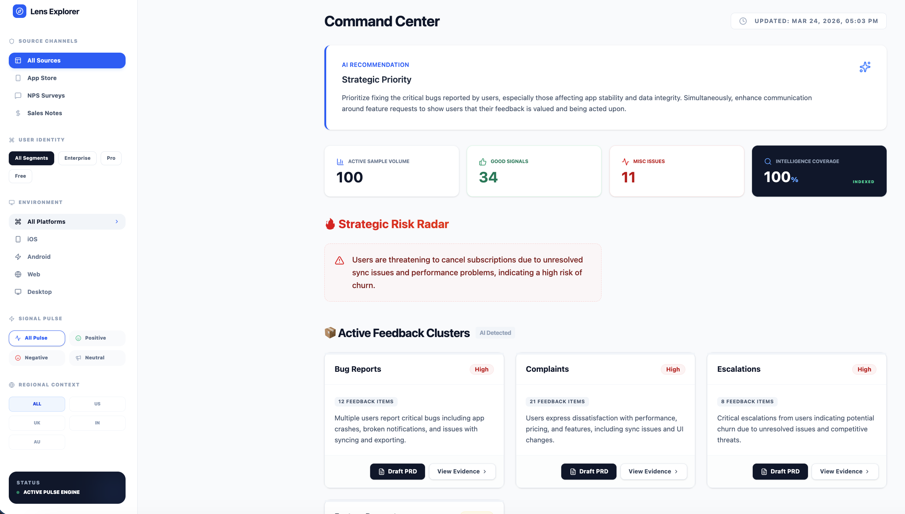
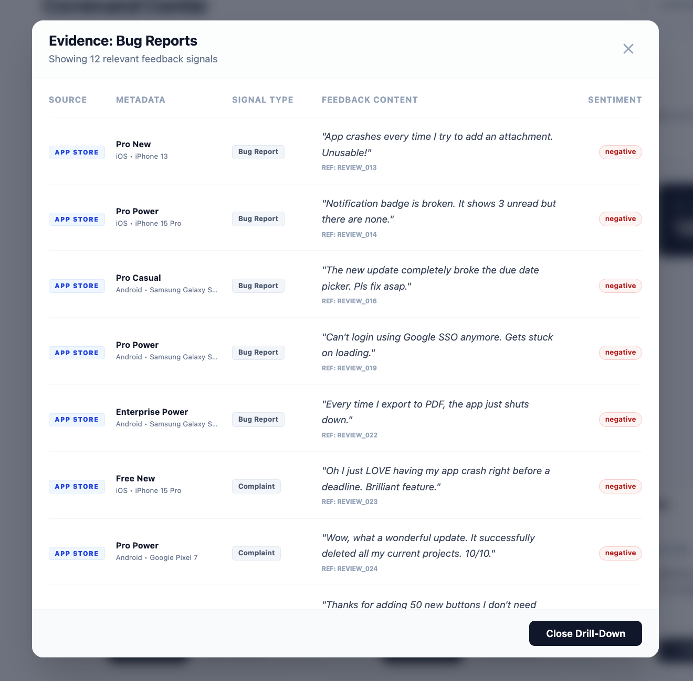
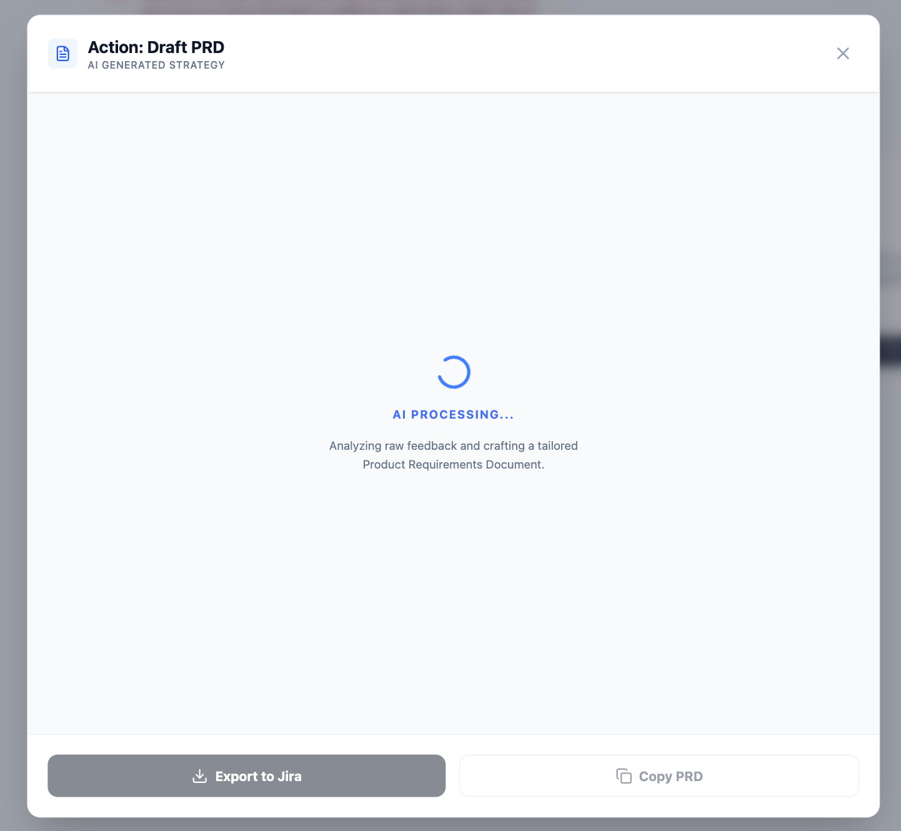
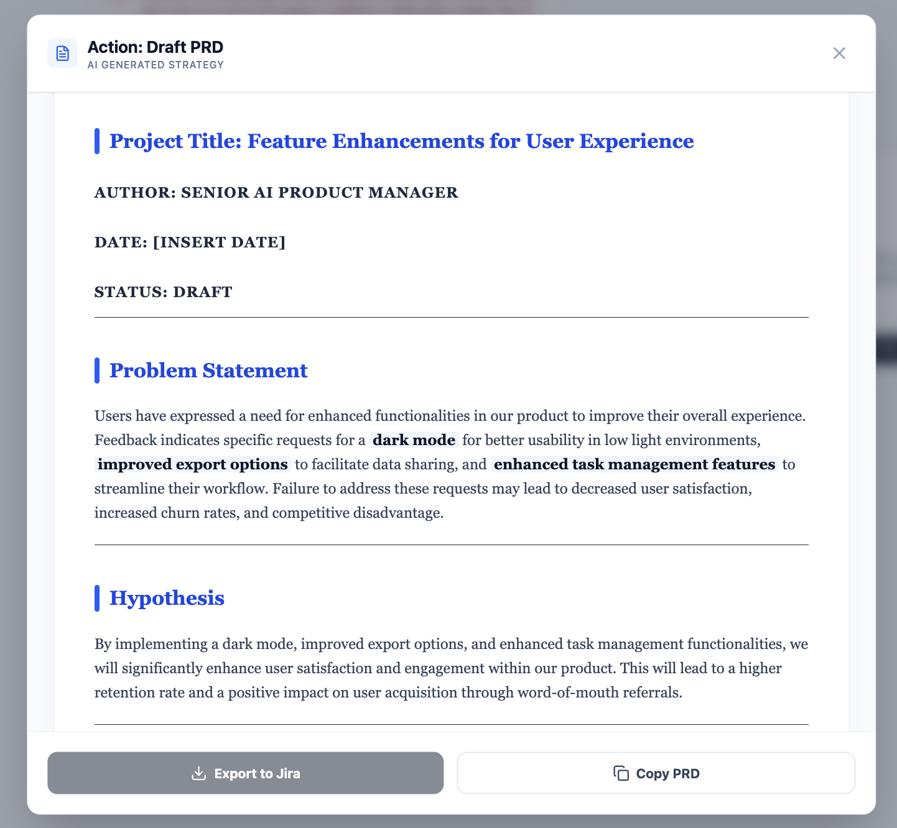
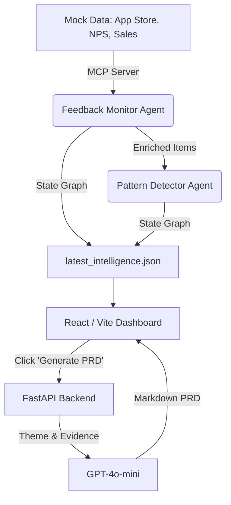

# 🔄 Feedback Intelligence Agent

An autonomous, multi-agent system designed to aggregate, analyze, and convert scattered user feedback into actionable Product Requirement Documents (PRDs).

      

## 🖥️ Product Snapshot

### Landing Page with feedback clusters


### Detail Evidence of Cluster Grouping


### PRD Generation




*Live demo available — run locally following setup instructions*

## 🚨 The Problem

Product Managers (PMs) are drowning in a sea of noisy, scattered qualitative data. For a typical B2B/B2C SaaS platform (like our focal use-case, ["FlowApp"](flowapp_backstory.md)), feedback arrives through fragmented channels:
- App Store Reviews (from free/pro users, often highly emotional, lacking context)
- NPS Surveys (from mid-tier users, often specific but varied in quality)
- Sales Call Notes (from enterprise accounts, focusing on SSO, API limits, and churn risks)

PMs spend hours manually tagging, sorting, and trying to spot macro-trends across these silos. The gap between "reading feedback" and "writing a PRD" is simply too large, resulting in recency bias, missed enterprise churn signals, and feature requests getting lost in the noise.

## 💡 The Solution

The Feedback Intelligence Agent automates the entire product feedback loop:
1. **Ingestion & Enrichment:** Uses the Model Context Protocol (MCP) to standardize data extraction from disparate sources, then employs an AI monitor agent to enrich each item with sentiment, intent, and actionable tags.
2. **Pattern Synthesis:** A LangGraph-based supervisor workflow clusters these enriched items, detects cross-source themes, identifies emerging enterprise risks, and generates PM recommendations.
3. **Actionability:** A React-based intelligence dashboard allows PMs to explore these trends and, with a single click, invoke a FastAPI service that generates a highly technical, ready-to-use PRD based strictly on the clustered evidence.

## 🎯 Why I Built This

I built this to demonstrate a modern, practical application of AI in product management—moving beyond simple chatbots to create a system that performs asynchronous, structured reasoning. I wanted to showcase how LangGraph can be used to coordinate multiple specialized agents (a "fetcher" and an "analyst") simulating a real-world PM data pipeline, and how to bridge the gap between back-end AI analysis and a front-end user interface where actual work gets done.

## 🏗️ Architecture



## ⚙️ How It Works

1. **MCP Integration:** An MCP server exposes tools to search and retrieve raw feedback from local mock data sources (App Store, NPS, Sales Notes).
2. **The Aggregator Agent:** A LangGraph node connects to the MCP server, fetches data across all three sources, and enriches every item with contextual data (e.g., detecting hidden feature requests within negative reviews).
3. **The Analyst Agent:** A second LangGraph node ingests the combined, enriched clipboard, running a zero-shot clustering algorithm to group feedback into priority themes, extract emerging risks, and output a structured strategic report.
4. **Persistence & UI:** The resulting JSON report is saved locally and consumed by a Vite/React frontend, which displays interactive cluster cards and sentiment breakdowns.
5. **PRD Generation:** When a PM investigates a cluster, they can trigger an action. The React app calls a local FastAPI server, which prompts an LLM to draft a structured, technical PRD (including hypothesis, success metrics, and user stories) directly from the specific feedback items.

## 🛠️ Tech Stack

| Component | Technology | Why I chose it |
| :--- | :--- | :--- |
| **LLM** | OpenAI GPT-4o-mini | Fast, cost-effective, and highly capable for text classification, clustering, and technical document generation. |
| **Agent Orchestration** | LangGraph | Enabled a stateful, cyclical graph architecture where the output of the data fetcher naturally drives the pattern detector via a shared "clipboard". |
| **Data Provider** | Model Context Protocol (MCP) | Demonstrated standardized, scalable tool usage for agents to securely fetch data from external systems. |
| **Backend API** | FastAPI | Lightweight, asynchronous Python framework perfect for serving our prompt-chaining PRD generator to the frontend. |
| **Frontend** | React (Vite) + Tailwind | Enabled rapid prototyping of a high-fidelity, interactive B2B dashboard to visualize the agent's output. |

## 📚 The Mock Case Study: "FlowApp"

To make the data realistic, the agent operates on a fictional SaaS product called **[FlowApp](flowapp_backstory.md)**:
- **B2C/Freelance:** Free/Pro users complaining about mobile sync and UI in the App Store.
- **Mid-Market:** Operations managers providing detailed time-tracking feedback via NPS surveys.
- **Enterprise:** IT Directors discussing SSO failures, API limits, and churn risk in Sales calls.

This diverse dataset intentionally challenges the agent to weigh a high volume of minor App Store complaints against a low volume of high-value Enterprise requests.

## ⚠️ Known Limitations

1. **Zero-Shot Clustering Volatility:** The Pattern Detector uses a single zero-shot LLM pass to cluster feedback. With very large datasets, this approach can occasionally produce overlapping or ambiguously named clusters.
2. **Static Mock Data:** The current MCP server pulls from static JSON/Markdown arrays in memory rather than a live database or real external API integrations.
3. **PRD Template Rigidity:** The FastAPI PRD generator uses a hardcoded system prompt yielding a specific PRD structure. It does not currently adapt to different organizational PRD templates.
4. **Token Limits Unmanaged:** The architecture dumps the entirety of a cluster's raw feedback into the PRD generator prompt. In a real-world scenario with thousands of items per cluster, this would require map-reduce summarization to avoid exceeding context windows.

## 🧠 PM Learnings

1. **State Matters More Than Prompts:** While prompt engineering is fun, designing the `AgentState` in LangGraph was the most critical architectural decision. Having a clean, shared "digital clipboard" passing between agents dramatically reduced complexity.
2. **Bridging AI and the UI:** Back-end agent scripts are neat, but the real "aha" moment comes when the AI outputs are hooked into an interactive UI. Giving the user the agency to click "Generate PRD" based on pre-processed AI intelligence turns an interesting demo into a useful product.
3. **The Value of Granular Empathy:** Enforcing the extraction of the exact user quotes into the final `latest_intelligence.json` ensured that even when the AI hallucinates a trend name, the PM can always read the raw evidence that generated it. Grounding is just as important in analysis as it is in RAG.

## 🚀 What I'd Build Next (V2)

1. **Live Integrations:** Upgrade the MCP server to pull live data from Zendesk, Salesforce, and real Google Play/App Store scraping pipelines.
2. **Dynamic PRD Templating:** Allow PMs to paste their own company's empty PRD template into the UI, dynamically instructing the LLM on how to format the output.
3. **Map-Reduce Clustering:** Implement a hierarchical map-reduce graph for the Pattern Detector to safely summarize thousands of feedback items without hitting token limits.
4. **Slack/Jira Webhooks:** Add a LangGraph node that automatically pushes the finalized PRD directly to a Jira Epic or a Slack channel for engineering review.

## 💻 How to Run

```bash
git clone https://github.com/prasenjeet-jena/ai-agent-portfolio.git
cd projects/02-feedback-loop-agent

# Set up the Python Environment
pip install -r requirements.txt
cp .env.example .env
# Edit .env and add your OPENAI_API_KEY

# 1. Run the LangGraph Data Pipeline (Generates the intelligence report)
python3 src/supervisor_graph.py

# 2. Start the FastAPI backend (for PRD generation)
uvicorn src.api_server:app --reload --port 8000

# 3. Start the React Dashboard (in a new terminal)
cd ui
npm install
npm run dev
```
